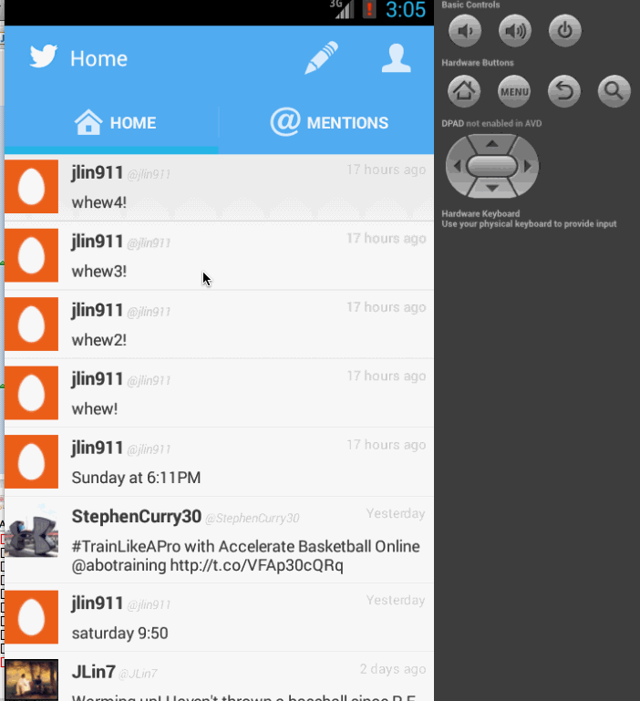

This is a twitter clone with user home timeline and compose new tweet feature

User Stories:

* [x] Required: User can sign in to Twitter using OAuth login
* [x] Required: User can view the tweets from their home timeline
* [x] Required: User should be able to see the username, name, body and timestamp for each tweet
* [x] Required: User should be displayed the relative timestamp for a tweet "8m", "7h"
* [x] Required: User can compose a new tweet
* [x] Required: User can click a “Compose” icon in the Action Bar on the top right
* [x] Required: User can then enter a new tweet and post this to twitter
* [x] Required: User can view more tweets as they scroll with infinite pagination
* [x] Required: User is taken back to home timeline with new tweet visible in timeline
* [x] Advanced: User can refresh tweets timeline by pulling down to refresh (i.e pull-to-refresh)
* [x] Advanced: User can open the twitter app offline and see last loaded tweets
	Tweets are persisted into sqlite and can be displayed from the local DB
* [x] Required: User can view their home timeline tweets.
* [x] Required: User can view the recent mentions of their username.
* [x] Required: User can scroll to bottom of either of these lists and new tweets will load ("infinite scroll")	
* [x] Required: User can see picture, tagline, # of followers, # of following, and tweets on their profile.
* [x] Required: User can see picture, tagline, # of followers, # of following, and tweets of clicked user.
* [x] Required: Profile view should include that user's timeline
	
Time spent: +/- 10 hours	
	
	
